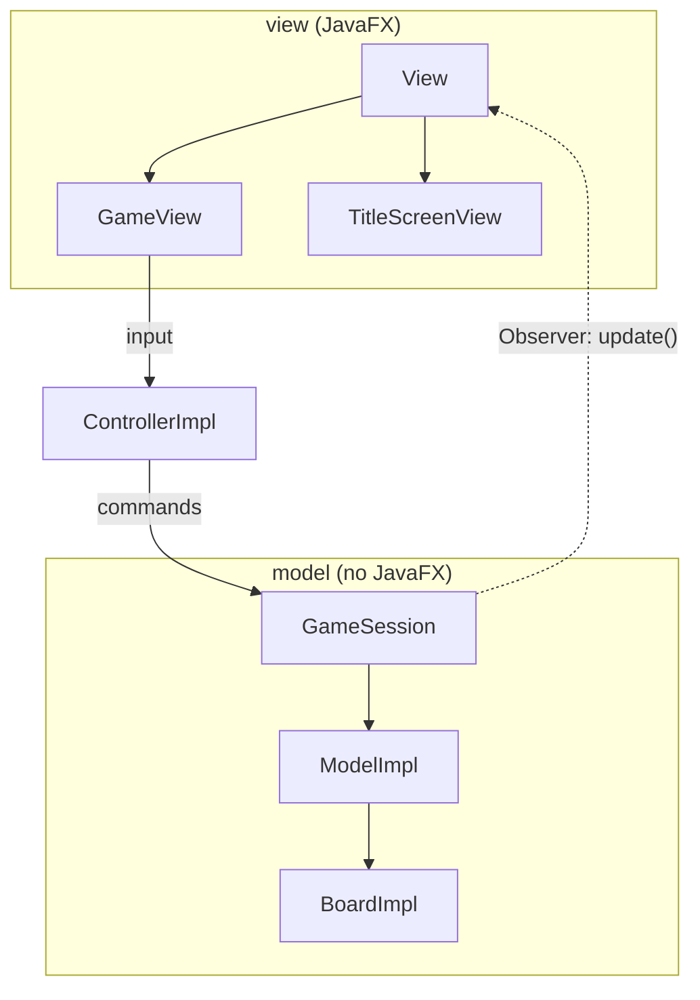

# Dungeon Crawler

[](https://github.com/Durantco8/dungeon-crawler-game/actions/workflows/ci.yml)


A tile-based dungeon crawler in Java and JavaFX. Dungeons are generated by binary space partitioning,
every level is proved solvable before you see it, and the enemies path around walls with A* and only
chase what they can actually see.

Every game is reproducible from a single seed, which is what makes saving, replaying, and undo the same
feature underneath.

## Screenshots

<!-- TODO: add screenshots.
     Suggested: the title screen, a generated dungeon on hard mode, and a game over.
     Run with ./mvnw javafx:run, then drop the images in docs/images/ and link them here. -->

_Not yet added._

## Features

- **Procedurally generated dungeons.** Rooms and corridors laid out by recursive binary space
  partitioning. A 28x18 board yields 8 to 13 rooms, with 141 to 255 walkable cells across 3000 seeds.
- **Every level is solvable.** A breadth-first search confirms the hero can reach the exit and every
  treasure before the level is handed over. Unwinnable levels cannot reach the player.
- **Enemies that path.** A* routing around walls, so an enemy will walk *away* from you in order to reach
  you, rather than pressing against a wall.
- **Three enemy archetypes.** A chaser that comes straight at you, an ambusher that aims where you are
  going rather than where you are, and a patroller that walks a beat between rooms.
- **Line of sight.** Enemies pursue only what they can see, along a Bresenham line. Break line of sight
  and they head for where they last saw you, then give up.
- **Different speeds.** Pieces bank energy and act when they can afford to, so a fast ambusher takes an
  extra step on alternate turns and a heavy patroller can be outrun.
- **Undo.** Any number of moves, restoring enemy state exactly.
- **Save, load, and replay.** A saved game is a seed and a string of moves, so a whole session is about a
  kilobyte of readable text that replays exactly.
- **Persistent high scores**, kept between runs.
- **A headless simulation harness** that plays hundreds of games with four scripted agents, one of which
  avoids enemies, and reports win rates, survival distributions, and generator statistics.
- Two difficulties, dark and light themes.

## Running it

Requires **Java 24 or newer**. Maven is not required: the repository includes the Maven wrapper.

```bash
./mvnw javafx:run          # play
./mvnw test                # run the suite and produce a coverage report
./mvnw package             # build a standalone jar
java -jar target/dungeon-crawler-game-1.0-SNAPSHOT.jar
```

The coverage report lands in `target/site/jacoco/index.html`.

### The simulation harness

Plays games with no display and reports win rates, survival, and generator statistics.

```bash
./mvnw compile
java -cp target/classes com.durantco.dungeon.sim.Simulate --games 200 --hard
```

```
Clear rate by level
-------------------
  level 1   reached by 200   cleared  27.5%
  level 2   reached by 55    cleared  16.4%
  level 3   reached by 9     cleared  22.2%
  level 4   reached by 2     cleared   0.0%

Survival turns
--------------
  p10        5 turns
  p50       22 turns
  p90       58 turns
  p100     107 turns

Outcomes
--------
  hero caught   100.0%
  average score      4.3
  shortest run  2 turns on seed 12, replay that seed to see it

Generator
---------
  levels built  250
  solvable      100.0%
  regenerations 0
```

Options: `--games N`, `--agent random|exit-runner|treasure-hunter|survivor`, `--seed N`,
`--max-turns N`, `--hard`, `--help`. Every game is seeded, and the report names the seed of its shortest
run, so any result can be reproduced by replaying that seed.

### What the agents measure

Three of the four agents ignore enemies completely, so on their own they cannot tell you whether the game
is hard or whether they are simply careless. The `survivor` agent exists to settle that: it has the same
goal as `exit-runner` and differs *only* in avoiding danger, which isolates the variable.

Over 200 games on hard, same seeds for both:

| | exit-runner | survivor |
| --- | --- | --- |
| Median survival | 20 turns | **38 turns** |
| 90th percentile | 46 turns | **253 turns** |
| Reached the turn limit alive | 0% | **6.5%** |
| Cleared level 1 | 53.5% | 56.0% |
| Cleared level 2 | 42.1% | 50.9% |

Caution roughly doubles median survival and lets some runs last indefinitely, so the earlier "100% of
runs end with the hero caught" was partly an artefact of careless agents.

But it barely moves the clear rates, and that is the more interesting half. Surviving and *progressing*
turn out to be different problems: the survivor stays alive largely by declining to advance, and roughly
half of all attempts at level 1 still fail either way. The difficulty is real, not an artefact.

The generator statistics carry no such caveat. Across 250 generated levels, every one was solvable and
none had to be regenerated.

## Architecture

Model–View–Controller with the Observer pattern, and one rule that shapes everything else: **the model
never imports JavaFX.** Game logic runs headless, which is why the whole suite finishes in seconds and
why the simulation harness can play hundreds of games on a machine with no display.

[Full diagrams are in `docs/ARCHITECTURE.md`](docs/ARCHITECTURE.md), including how a turn resolves and how
a level is built.



### Collisions are resolved by the piece being entered

The original code asked what a piece *was*:

```java
if (other instanceof Treasure) { ... }
else if (other instanceof Enemy) { ... }
else if (other instanceof Wall) { throw new IllegalArgumentException(); }
throw new IllegalArgumentException();
```

Every piece type appeared in every mover's collision method, so adding a piece meant editing code that
already worked, and the bottom of each chain threw an exception that the board relied on never happening.

It now asks the piece being walked into what happens:

```java
CollisionResult outcome = target.onHeroEnter(hero);
```

`Treasure` knows it is worth five points, `Wall` knows it is impassable, `Exit` knows it ends the level.
Adding a piece type is one new file and no edits to any existing class. The `BLOCKED` outcome also removed
the board's separate `instanceof Wall` checks, so pathfinding, line of sight, and movement all ask the same
question and cannot disagree about what a wall is.

**Why not the visitor pattern?** Visitor makes adding *operations* cheap and adding *types* expensive: a
new piece type means a new method on the visitor interface and an edit to every existing visitor. The
growth here is in types, not operations, so visitor points the wrong way. A sealed interface with
exhaustive pattern matching was the runner-up, trading open extension for compile-time exhaustiveness; it
is used for `GeneratorSpec`, where the set really is closed and exhaustiveness catches save-format
omissions at compile time.

### Determinism

Everything nondeterministic is injected. There is no `new Random()` below the composition root, no clock,
and no iteration over a hash set whose order could vary. A `GameSetup` plus the list of inputs is therefore
a complete account of a game.

That single property pays for four features:

| Feature | How it works |
| --- | --- |
| Replay | Re-run the recording |
| Save / load | Write the recording to a file |
| Undo | Drop the last input and replay the rest |
| Reproducible bug reports | The simulation report names the seed |

Undo deserves a note, because the textbook answer is wrong here. Enemies carry state that is not on the
board: where they last saw the hero, their position on a patrol, banked energy. A snapshot-based undo would
have to capture all of it, and every archetype added later would be one more thing to remember to save,
with forgetting producing a silent wrong answer. Replaying restores it because it restores everything. A
test pins exactly that: undo a move, redo it, and the result matches the game that never undid at all.

## Algorithms

### Binary space partitioning

The board starts solid and is recursively cut in two along whichever axis is longer, until a region is too
small to cut or the depth limit is reached. Each leaf gets a room carved inside it with a one-cell margin
so neighbouring rooms never merge. As the recursion unwinds, **each node joins its two children with an
L-shaped corridor.**

Connecting on the way back up is the part that matters: every node links its two subtrees, so by induction
the floor is a single connected region *by construction*, not by luck.

### Breadth-first solvability

Before a level is accepted, a flood fill from the hero must reach the exit and every treasure. Passability
is asked of the pieces, the same rule movement uses, so the search and the game can never disagree.

Because the generator guarantees connectivity, this check is an **assertion**, not a repair step. A test
asserts the retry counter stays at exactly one across 400 seeds: if it ever climbs, the generator has a
bug, which is a far more useful signal than a level being quietly regenerated. The retry budget still earns
its keep for the older random-scatter generator, which makes no such promise and could strand the exit
behind a wall.

### A* pathfinding

Enemies follow shortest four-way routes with a Manhattan heuristic, exact for uniform-cost four-way
movement, so the first path found is optimal.

Ties break on a **total order**: cost, then remaining distance, then row, then column. Ordering on cost
alone would leave the choice among equal-cost nodes to the priority queue's internal layout, so the same
seed could produce different paths of the same length and a recorded game would not replay. That makes
tie-breaking a correctness requirement rather than tidiness, and it is asserted directly.

### Bresenham line of sight

Sight is traced along a Bresenham line, with walls blocking and pieces not.

Bresenham turns out not to be symmetric: where the true line passes exactly between two cells, which one it
picks depends on which end the walk started from, so one cell could see another that could not see it back.
The endpoints are ordered before walking, which makes sight a symmetric relation for the cost of one
comparison. A test asserts it exhaustively over every pair of cells in a grid.

### Energy-based turns

Each piece banks energy per turn and acts as often as it can afford. Expressing rates against a cost rather
than as "acts every N turns" is what allows a rate that does not divide evenly into whole turns, so a fast
enemy takes a second step on alternate turns rather than two steps every turn. The hero has no meter: a
game that sometimes ignored a keypress would read as broken rather than as tactical.

## Testing

472 tests, all headless. Nothing in the test tree imports JavaFX.

```bash
./mvnw test
```

Coverage outside the view sits at 98.6% of lines and 95.3% of branches, with a floor enforced in CI so a
change that quietly guts the tests fails the build. The view is excluded deliberately: counting it would
measure how much interface exists rather than how well the game logic is covered.

Some of the more interesting tests:

- 400 seeds, every level solvable, and the generator never needing a second attempt.
- A recorded session replayed and compared **move for move**, not just at the end, since matching only at
  the end would pass even if the replay diverged and reconverged.
- Line of sight asserted symmetric over every pair of cells in a grid.
- Undo followed by redo, compared against a game that never undid, which only matches if hidden enemy
  state came back.

## Project structure

```
src/main/java/com/durantco/dungeon/
├── Main.java
├── controller/          input, forwarded to the model
├── model/
│   ├── GameSetup        a game as data: seed, size, difficulty, generator
│   ├── GameSession      the current game plus the record of how it got there
│   ├── board/           grid, generation, pathfinding, sight, enemy strategies
│   ├── pieces/          hero, enemies, walls, treasure, thieves, exits
│   └── replay/          commands, recordings, replay, save format
├── persistence/         saved games and high scores
├── sim/                 scripted agents and the headless harness
└── view/                JavaFX rendering and sprite mapping
```

## Built with

Java 24, JavaFX 21, Maven, JUnit 5, JaCoCo. No other dependencies.
