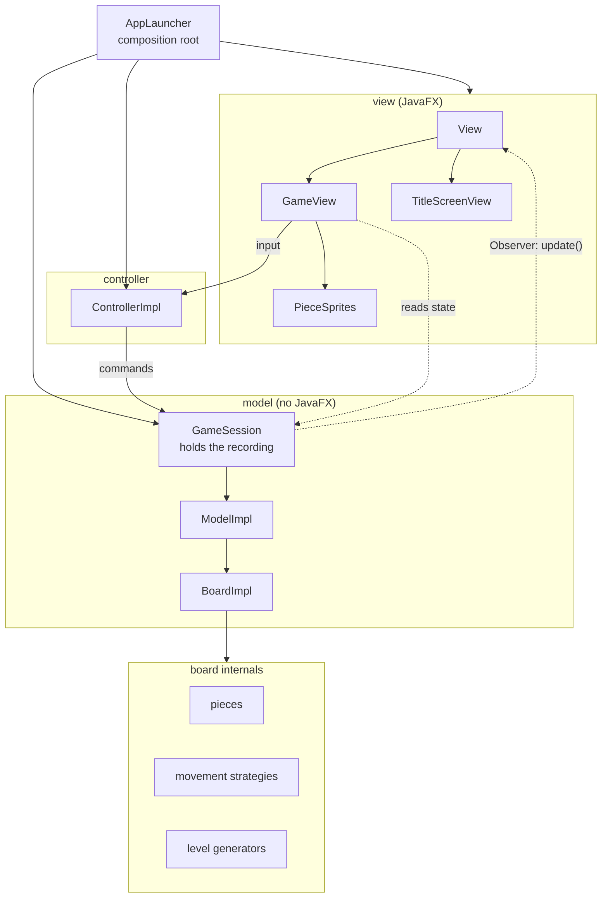
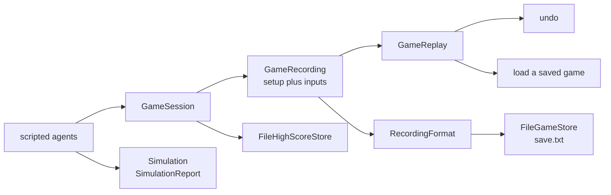
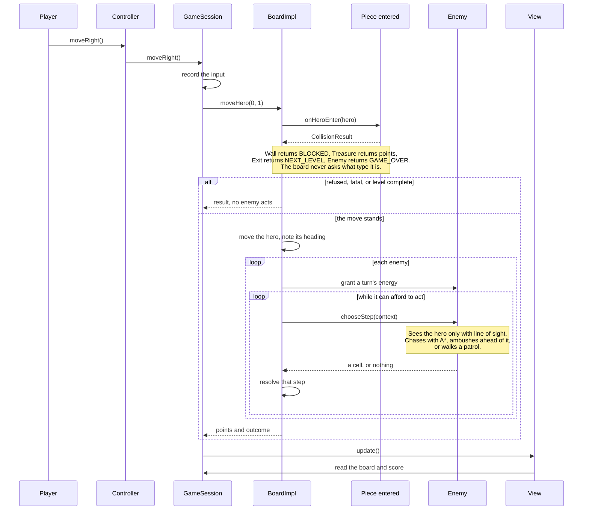
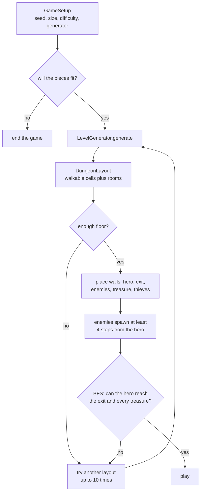

# Architecture

Three diagrams: how the layers fit together, how one turn resolves, and how a level gets built.

## Layers

Model–View–Controller with the Observer pattern carrying changes back to the screen. The arrows are
dependencies, so the absence of an arrow matters as much as its presence: **nothing in the model points at
the view.**

Everything above the model line knows about JavaFX; nothing below it does. The game logic runs headless,
which is what lets the whole suite finish in a couple of seconds and lets the simulation harness play
hundreds of games on a machine with no display.

Persistence and tooling hang off the same model, never off the view:

A recording is a setup and a string of moves. Because the game is reproducible from its seed, that one
value is the whole of a game, which is why replay, saving, loading, and undo are all the same feature
wearing different hats.

Two things worth pointing out.

**`GameSession` is a `Model`.** It forwards to whichever model is current and can replace it underneath.
That is what makes undo possible: rebuilding a game produces a new `ModelImpl`, and a view holding the old
one directly would be left watching a game nobody is playing.

**The view maps pieces to sprites, not the model.** A `Piece` exposes a `PieceType`, and `PieceSprites` in
the view decides which PNG that is in which theme. The model has never heard of a file.

## One turn

What happens between a keypress and a redraw. The interesting part is that collisions are resolved by
asking the piece being walked into, never by testing its type.

## Building a level

Generation and verification are separate, and both happen before the player sees anything.

The retry loop is a safety net, not the mechanism. The partitioning generator joins every node of its tree
to its sibling as the recursion unwinds, so the floor is connected **by construction** and the BFS check is
an assertion about that property. A test asserts the retry counter stays at exactly one across 400 seeds:
if it ever climbs, the generator has a bug, which is a far more useful signal than a level being quietly
regenerated. The same budget does real work for the older scatter generator, which makes no such promise.
